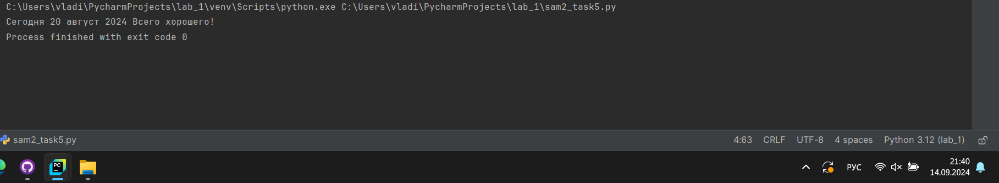

# Тема 3. Операторы, условия, циклы
Отчет по Теме #3 выполнил:
- Ватолин Владимир Олегович
- ПИЭ-22-1

| Задание | Лаб_раб | Сам_раб |
| ------ |---------|---------|
| Задание 1 | +       | +       |
| Задание 2 | +       | +       |
| Задание 3 | +       | +       |
| Задание 4 | +       | +       |
| Задание 5 | +       | +       |
| Задание 6 | +       | -       |
| Задание 7 | +       | -       |
| Задание 8 | +       | -       |
| Задание 9 | +       | -       |
| Задание 10 | +       | -       |

знак "+" - задание выполнено; знак "-" - задание не выполнено;

Работу проверили:
- к.э.н., доцент Панов М.А.

## Лабораторная работа №1
### Создайте две переменные, значение которых будете вводить через консоль. Также составьте условие, в котором созданные ранее переменные будут сравниваться, если условие выполняется, то выведете в консоль «Выполняется», если нет, то «Не выполняется».

```python
print(123)
print('123')
print(1.23)
```
### Результат.


### Выводы

В данном коде выводятся три строки с использованием функции `print()`. Каждая строка содержит разные значения:

1. `print(123)`: Выводится целое число 123. Это число не взаимодействует со строковыми операциями и выводится как есть.

2. `print('123')`: Выводится строка '123', так как она заключена в одинарные кавычки. В этом случае это текстовая строка, а не число.

3. `print(1.23)`: Выводится число с плавающей точкой 1.23. Так же, как и в первом случае, оно выводится как числовое значение.

## Лабораторная работа №2
### Напишите программу, которая будет определять значения переменной меньше 0, больше 0 и меньше 10 или больше 10. Это нужно реализовать при помощи одной переменной, значение которой будет вводится через консоль, а также при помощи конструкций if, elif, else.

```python
print(100 + 100)
print(5.5 - 2.5)
print(3 + 2.5 + 5 + 5.5)
```
### Результат.


### Выводы

1. `print(100 + 100)` суммируем два числа тип int и выводим на экран
2. `print(5.5 - 2.5)` выводим на экран разность двух чисел типа float
3. `print(3 + 2.5 + 5 + 5.5)` выводим на экран сумму двух чисел типа int и двух чисел типа float

## Лабораторная работа №3
### Напишите программу, в которой будет проверяться есть ли переменная в указанном массиве используя логический оператор in. Самостоятельно посмотрите, как работает программа со значениями которых нет в массиве numbers.

```python
print('Hello, world!')

world = 'world'
print(f"Hello, {world}")

one = 'Hello, '
two = 'world'
print(one + two)
```
### Результат.


### Выводы

1. `print('Hello, world!')` выводим строку
2. `print(f"Hello, {world}")` выводим строку, при помощи f вставляя в нее переменную
3. `print(one + two)` выводим строку, которая ровна сумме двух строк
  
## Лабораторная работа №4
### Напишите программу, которая будет определять находится ли переменная в указанном массиве и если да, то проверьте четная она или нет. Самостоятельно протестируйте данную программу с разными значениями переменной value.

```python
a = 1
print(bool(a))

b = 2
print(float(b))

c = True
print(str(c))
```
### Результат.


### Выводы
1. `print(bool(a))` выводим целочисленную переменную переведя ее в булевый тип
2. `print(float(b))` выводим на экран целое число, конвертирую его во float
3. `print(str(c))` выводим строку, которая изначально была булевым типом

## Лабораторная работа №5
### Напишите программу, в которой циклом for значения переменной i будут меняться от 0 до 10 и посмотрите, как разные виды сравнений и операций работают в цикле.

```python
a = input("one: ")
b = input("two: ")
c = input("three: ")

print(a, b, c)
```
### Результат.


### Выводы

При помощи `input` осуществляем ввод с клавиатуры

## Лабораторная работа №6
### Напишите программу, в которой при помощи цикла for определяется есть ли переменная value в строке string и посмотрите, как работает оператор else для циклов. Самостоятельно посмотрите, что выведет программа, если значение переменной value оказалось в строке string. Определять индекс буквы не обязательно, но если вы хотите, то это делается при помощи строки: index = string.find(value) Вы берете название переменной, в которой вы хотите что-то найти, затем применяете встроенный метод find() и в нем указываете то, что вам нужно найти. Данная строка вернет индекс искомого объекта.

```python
a = 10
b = 4
print(a**b)
print(a / b)
print(a // b)
print(a % b)
```
### Результат.


### Выводы

1. `print(a**b)` возведение в степень 
2. `print(a / b)` деление
3. `print(a // b)` целочисленное деление
4. `print(a % b)` остаток от деления (деления по модулю)

## Лабораторная работа №7
### Напишите программу, в которой вы наглядно посмотрите, как работает цикл for проходя в обратном порядке, то есть, к примеру не от 0 до 10, а от 10 до 0. В уже готовой программе показано вычитание из 100, а вам во время реализации программы будет необходимо придумать свой вариант применения обратного цикла.

```python
s = "Hello"
print(s * 6)
```
### Результат.


### Выводы

`print(s * 6)` выводим строку 6 раз

## Лабораторная работа №8
### Напишите программу используя цикл while, внутри которого есть какие-либо проверки, но быть осторожным, поскольку циклы while при неправильно написанных условиях могут становится бесконечными, как указано в примере далее.

```python
s = "Hello world"
print(s.count("o"))
```
### Результат.


### Выводы

при помощи функции `count` можем получить частоту встречаемости символа в строке

## Лабораторная работа №9
### Напишите программу с использованием вложенных циклов и одной проверкой внутри них. Самое главное, не забудьте, что нельзя использовать одинаковые имена итерируемых переменных, когда вы используете вложенные циклы.


```python
print("Hello\nworld")
```
### Результат.


### Выводы

при помощи `\n` выполняем перенос на новую строку

## Лабораторная работа №10
### Напишите программу с использованием flag, которое будет определять есть ли нечетное число в массиве. В данной задаче flag выступает в роли индикатора встречи нечетного числа в исходном массиве, четных чисел.

```python
s = "Hello world"
print(s[1])
print(s[:5])
```
### Результат.


### Выводы

1. `print(s[1])` выводим 2 символ (нумерация с 0)
2. `print(s[:5])` выводим первые 5 символов

## Самостоятельная работа №1
### Задания для самостоятельного выполнения: 1) Напишите программу, которая преобразует 1 в 31.
### Для выполнения поставленной задачи необходимо обязательно и
### только один раз использовать:
### • Цикл for
### • *= 5
### • += 1
### Никаких других действий или циклов использовать нельзя.

```python
n = 0;
print(bool(n))
```
### Результат.


### Выводы

`print(bool(n))` конвертируем int в bool, 0 при переводе в bool даёт False
  
## Самостоятельная работа №2
### Напишите программу, которая фразу «Hello World» выводит в
### обратном порядке, и каждая буква находится в одной строке консоли.
### Пример вывода в консоль:
### При этом необходимо обязательно использовать любой цикл, а также
### программа должна занимать не более 3 строк в редакторе кода.

```python
a, b, c = 4, 5, 6
print(a, b, c)
```
### Результат.


### Выводы

В питон можно присваивать переменные данным образом
  
## Самостоятельная работа №3
### Напишите программу, на вход которой поступает значение из консоли, оно должно быть числовым и в диапазоне от 0 до 10 включительно (это
### необходимо учесть в программе). Если вводимое число не подходит по
### требованиям, то необходимо вывести оповещение об этом в консоль и
### остановить программу. Код должен вычислять в каком диапазоне
### находится полученное число. Нужно учитывать три диапазона:
### • от 0 до 3 включительно
### • от 3 до 6
### • от 6 до 10 включительно
### Результатом работы программы будет выведенный в консоль диапазон.
### Программа должна занимать не более 10 строчек в редакторе кода.

```python
i = int(input())
print(i)
```
### Результат.


### Выводы

при помощи `int` ограничиваем область допустим значений для ввода
  
## Самостоятельная работа №4
### Манипулирование строками. Напишите программу на Python, которая
### принимает предложение (на английском) в качестве входных данных
### от пользователя. Выполните следующие операции и отобразите
### результаты:
### • Выведите длину предложения.
### • Переведите предложение в нижний регистр.
### • Подсчитайте количество гласных (a, e, i, o, u) в предложении.
### • Замените все слова "ugly" на "beauty".
### • Проверьте, начинается ли предложение с "The" и заканчивается
### ли на "end".
### Проверьте работу программы минимум на 3 предложениях, чтобы
### охватить проверку всех поставленных условий.

```python
s = "a"
print(s * 16)
```
### Результат.


### Выводы

`print(s * 16)` если мы выведем строку 16 раз ее минимальная длина будет = 16
  
## Самостоятельная работа №5
### Составьте программу, результатом которой будет данный вывод в
### консоль:
### Программу нужно составить из данных фрагментов кода:
### Строки кода можно использовать только один раз.
### Не обязательно использовать все строки кода.

```python
day = 20
month = "август"
year = 2024
print(f"Сегодня {day} {month} {year} ", end="Всего хорошего!")
```
### Результат.



### Выводы

`print(f"Сегодня {day} {month} {year} ", end="Всего хорошего!")` решаем при помощи f

## Общие выводы по теме
Выполнив данную работу я освоил базовые операции со строками и в принципе их работу в python. Также освоил базовые математические операции, типы данных 
