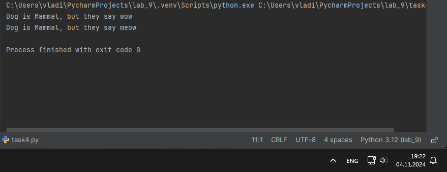
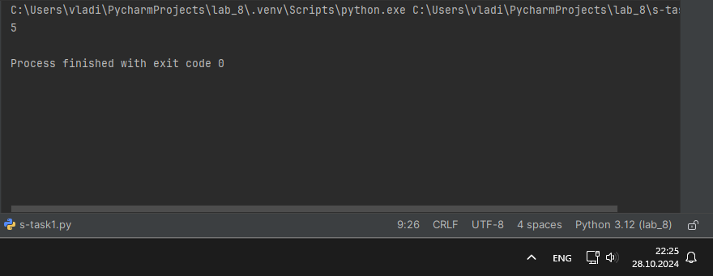
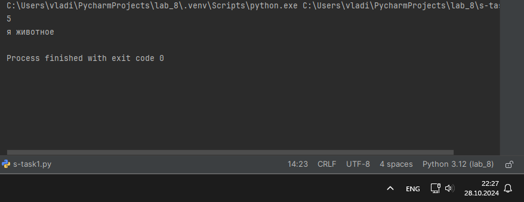

# Тема 6. Базовые коллекции: словари, кортежи
Отчет по Теме #6 выполнил:
- Ватолин Владимир Олегович
- ПИЭ-22-1

| Задание | Лаб_раб | Сам_раб |
| ------ |---------|---------|
| Задание 1 | +       | +       |
| Задание 2 | +       | +       |
| Задание 3 | +       | +       |
| Задание 4 | +       | +       |
| Задание 5 | +       | +       |

знак "+" - задание выполнено; знак "-" - задание не выполнено;

Работу проверили:
- к.э.н., доцент Панов М.А.

## Лабораторная работа №1
### В школе, где вы учились, узнали, что вы крутой программист и
### попросили написать программу для учителей, которая будет при вводе
### кабинета писать для него ключ доступа и статус, занят кабинет или нет.
### При написании программы необходимо использовать словарь (dict), который на вход получает номер кабинета, а выводит необходимую
### информацию. Если кабинета, который вы ввели нет в словаре, то в
### консоль в виде значения ключа нужно вывести “None” и виде статуса
### вывести “False”.
### По большому счету написав данную программу мы с вами научились
### заменять иногда громоздкую конструкцию if/elif/else. Поскольку здесь
### функционал словаря полностью повторяет функционал условия, но при
### этом у использования словарей в более сложных программах есть
### намного больше возможностей реализации.

```python
request = int(input('Введите номер кабинета: '))

dictionary = {
    101: {'key': 1234, 'access': True},
    102: {'key': 1337, 'access': True},
    103: {'key': 8943, 'access': True},
    104: {'key': 5555, 'access': False},
    None: {'key': None, 'access': False},
}

response = dictionary.get(request)

if not response:
    response = dictionary[None]
key = response.get('key')
access = response.get('access')
print(key, access)
```
### Результат.


### Выводы

По большому счету написав данную программу мы с вами научились
заменять иногда громоздкую конструкцию if/elif/else. Поскольку здесь
функционал словаря полностью повторяет функционал условия, но при
этом у использования словарей в более сложных программах есть
намного больше возможностей реализации.

## Лабораторная работа №2
### Алексей решил создать самый большой словарь в мире. Для этого он
### придумал функцию dict_maker (**kwargs), которая принимает
### неограниченное количество параметров «ключ: значение» и обновляет
### созданный им словарь my_dict, состоящий всего из одного элемента
### «first» со значением «so easy». Помогите Алексею создать данную
### функцию.
### Ниже на скриншоте мы использовали встроенный модуль pprint, который выводит большие объемы информации более понятно для
### восприятия человеческим глазом. Иногда очень удобно использовать
### данную возможность Python.

```python
from pprint import pprint

my_dict = {'first': 'so easy'}

def dict_maker(**kwargs):
    my_dict.update(**kwargs)

dict_maker(a1=1, a2=20, a3=54, a4=13)
dict_maker(name='Михаил', age=31, weight=70, eyes_color='blue')
pprint(my_dict)
```
### Результат.


### Выводы

мы использовали встроенный модуль pprint, который выводит большие объемы информации более понятно для
восприятия человеческим глазом. Иногда очень удобно использовать
данную возможность Python.

## Лабораторная работа №3
### Для решения некоторых задач бывает необходимо разложить строку на
### отдельные символы. Мы знаем что это можно сделать при помощи
### split(), у которого более гибкая настройка для разделения для этого, но
### если нам нужно посимвольно разделить строку без всяких условий, то
### для этого мы можем использовать кортежи (tuple). Для этого напишем
### любую строку, которую будем делить и “обвернем” ее в tuple и дальше
### мы можем как нам угодно с ней работать, например, сделать ее
### списком (тогда получится полный аналог split()) или же работать с ним
### дальше, как с кортежем.

```python
input_string = 'HelloWorld'
result = tuple(input_string)
print(result)
print(list(result))
```
### Результат.


### Выводы

мы можем использовать кортежи (tuple). Для этого напишем
любую строку, которую будем делить и “обвернем” ее в tuple и дальше
мы можем как нам угодно с ней работать, например, сделать ее
списком (тогда получится полный аналог split()) или же работать с ним
дальше, как с кортежем.
  
## Лабораторная работа №4
### Вовочка решил написать крутую функцию, которая будет писать имя, возраст и место работы, но при этом на вход этой функции будет
### поступать кортеж. Помогите Вовочке написать эту программу.


```python
def personal_info(name, age, company='unnamed'):
    print(f"Имя: {name} Возраст: {age} Компания: {company}")
    
tom = ("Григорий", 22)
personal_info(*tom)

bob = ("Георгий", 41, "Yandex")
personal_info(*bob)
```
### Результат.



### Выводы

писать имя, возраст и место работы, но при этом на вход этой функции будет
поступать кортеж.

## Лабораторная работа №5
### Для сопровождения первых лиц государства X нужен кортеж, но никто
### не может определиться с порядком машин, поэтому вам нужно
### написать функцию, которая будет сортировать кортеж, состоящий из
### целых чисел по возрастанию, и возвращает его. Если хотя бы один
### элемент не является целым числом, то функция возвращает исходный
### кортеж.


```python
def tuple_sort(tpl):
    for elm in tpl:
        if not isinstance(elm, int):
            return tpl
    return tuple(sorted(tpl))

print(tuple_sort((5, 5, 3, 1, 9)))
print(tuple_sort((5, 5, 2.1, '1', 9)))
```
### Результат.


### Выводы

написать функцию, которая будет сортировать кортеж, состоящий из
целых чисел по возрастанию, и возвращает его. Если хотя бы один
элемент не является целым числом, то функция возвращает исходный
кортеж.

## Самостоятельная работа №1
### При создании сайта у вас возникла потребность обрабатывать
### данные пользователя в странной форме, а потом переводить их в
### нужные вам форматы. Вы хотите принимать от пользователя
### последовательность чисел, разделенных пробелом, а после
### переформатировать эти данные в список и кортеж. Реализуйте вашу
### задумку. Для получения начальных данных используйте input().
### Результатом программы будет выведенный список и кортеж из
### начальных данных.

```python
s = input()

my_list = s.split(" ")
my_dict = tuple(s.replace(" ", ""))

print(my_list)
print(my_dict)
```
### Результат.



### Выводы

1. `my_list = s.split(" ")` разделяем строку по пробелам при помощи сплит
2. `my_dict = tuple(s.replace(" ", ""))` удаляем пробелы и приводим к виду tuple
  
## Самостоятельная работа №2
### Николай знает, что кортежи являются неизменяемыми, но он очень
### упрямый и всегда хочет доказать, что он прав. Студент решил
### создать функцию, которая будет удалять первое появление
### определенного элемента из кортежа по значению и возвращать
### кортеж без него. Попробуйте повторить шедевр не признающего
### авторитеты начинающего программиста. Но учтите, что Николай не
### всегда уверен в наличии элемента в кортеже (в этом случае кортеж
### вернется функцией в исходном виде).
### Входные данные:
### (1, 2, 3), 1)
### (1, 2, 3, 1, 2, 3, 4, 5, 2, 3, 4, 2, 4, 2), 3) (2, 4, 6, 6, 4, 2), 9)
### Ожидаемый результат:
### (2, 3)
### (1, 2, 1, 2, 3, 4, 5, 2, 3, 4, 2, 4, 2)
### (2, 4, 6, 6, 4, 2)

```python
def remove_element(tup, value):
    new_list = []

    for x in tup:
        if x != value:
            new_list.append(x)

    return tuple(new_list)


my_tuple = (1, 2, 3, 4, 5)
element_to_remove = 3

new_tuple = remove_element(my_tuple, element_to_remove)
print("Новый кортеж:", new_tuple)
```
### Результат.



### Выводы

1. `for x in tup:` проходимся по всем элементам списка
2. `new_list.append(x)` если элемент не равен заданному добавляем его в список
  
## Самостоятельная работа №3
### Ребята поспорили кто из них одним нажатием на numpad наберет
### больше повторяющихся цифр, но не понимают, как узнать
### победителя. Вам им нужно в этом помочь. Дана строка в виде
### случайной последовательности чисел от 0 до 9 (длина строки
### минимум 15 символов). Требуется создать словарь, который в
### качестве ключей будет принимать данные числа (т. е. ключи будут
### типом int), а в качестве значений – количество этих чисел в
### имеющейся последовательности. Для построения словаря создайте
### функцию, принимающую строку из цифр. Функция должна
### возвратить словарь из 3-х самых часто встречаемых чисел, также
### эти значения нужно вывести в порядке возрастания ключа.


```python
from collections import Counter


def most_frequent_digits(s):
    digit_count = Counter(int(digit) for digit in s)

    most_common_digits = digit_count.most_common(3)

    most_common_digits_sorted = sorted(most_common_digits)

    result_dict = {}

    for digit, count in most_common_digits_sorted:
        result_dict[digit] = count

    return result_dict


input_string = "1234567890123456789012345"
result = most_frequent_digits(input_string)

print("Три самых частых числа и их количество:", result)
```
### Результат.


### Выводы

1. `digit_count = Counter(int(digit) for digit in s)` считаем кол-во каждого символа
2. `most_common_digits = digit_count.most_common(3)` находим 3 самых часто встречающихся числа
3. `most_common_digits_sorted = sorted(most_common_digits)` сортируем по возрастанию чисел (ключей)
4. `for digit, count in most_common_digits_sorted:` добавляем в словарь отсортированные значения
  
## Самостоятельная работа №4
### Ваш хороший друг владеет офисом со входом по электронным
### картам, ему нужно чтобы вы написали программу, которая
### показывала в каком порядке сотрудники входили и выходили из
### офиса. Определение сотрудника происходит по id. Напишите
### функцию, которая на вход принимает кортеж и случайный элемент
### (id), его можно придумать самостоятельно. Требуется вернуть
### новый кортеж, начинающийся с первого появления элемента в нем и
### заканчивающийся вторым его появлением включительно.
### Если элемента нет вовсе – вернуть пустой кортеж.
### Если элемент встречается только один раз, то вернуть кортеж, который начинается с него и идет до конца исходного.
### Входные данные:
### (1, 2, 3), 8)
### (1, 8, 3, 4, 8, 8, 9, 2), 8)
### (1, 2, 8, 5, 1, 2, 9), 8)
### Ожидаемый результат:
### ()
### (8, 3, 4, 8)
### (8, 5, 1, 2, 9)

```python
def extract_subtuple(tup, element):
    if element not in tup:
        return () 

    first_index = tup.index(element)

    try:
        second_index = tup.index(element, first_index + 1)
        return tup[first_index:second_index + 1]
    except ValueError:
        return tup[first_index:]

my_tuple = (1, 2, 3, 4, 5, 3, 6, 7, 3, 8, 9)
element_to_find = 3

result = extract_subtuple(my_tuple, element_to_find)
print("Результат:", result)
```
### Результат.


### Выводы

1. `if element not in tup:` проверяем, есть ли элемент в кортеже
2. `first_index = tup.index(element)` находим первое появление элемента
3. `second_index = tup.index(element, first_index + 1)` ищем второе появление элемента после первого
4. `return tup[first_index:second_index + 1]` возвращаем кортеж от первого до второго появления элемента
5. `return tup[first_index:]` если второго появления нет, возвращаем кортеж от первого появления до конца
  
## Самостоятельная работа №5
### Самостоятельно придумайте и решите задачу, в которой будут
### обязательно использоваться кортеж или список. Проведите
### минимум три теста для проверки работоспособности вашей задачи.

```python
def describe_strings(string_list):
    result = []

    for string in string_list:
        if string == "":
            result.append("Пусто")
        else:
            result.append(f"Строка: {len(string)} символов")

    return result


# Тесты
test1 = ["Привет", "Как дела?", "Python", ""]
test2 = ["", "", "Тест", "12345"]
test3 = ["Слон", "Кит", "Мышь", ""]

# Проверяем работу функции
result1 = describe_strings(test1)
result2 = describe_strings(test2)
result3 = describe_strings(test3)

print("Тест 1:", result1)
print("Тест 2:", result2)
print("Тест 3:", result3)
```

### Результат.


### Выводы

Напишите функцию, которая принимает список строк, и возвращает список, где каждая строка содержит количество символов в оригинальной строке. Если строка пустая, она заменяется на строку "Пусто".

## Общие выводы по теме
Освоил работу со словарями, картежами на базовом уровне. Точнее примерно понял как они работают именно в питоне