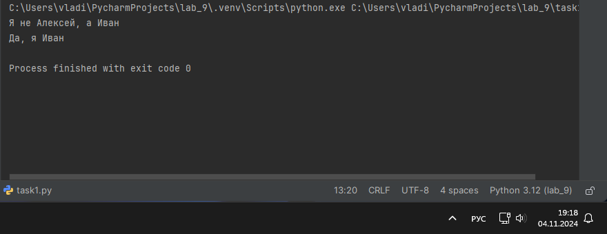
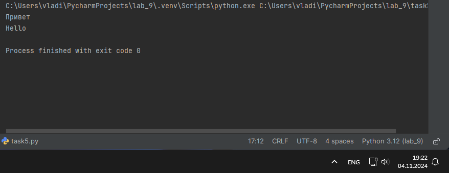
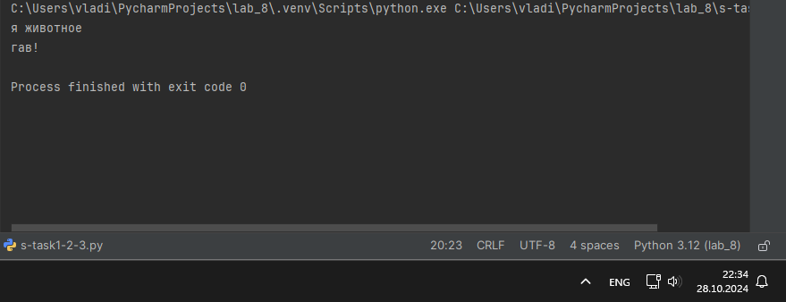
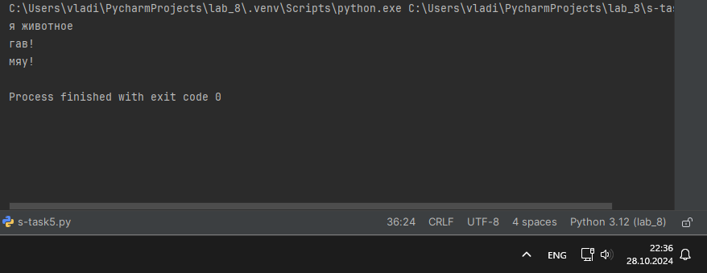

# Тема 8. Основы объектно-ориентированного программирования
Отчет по Теме #8 выполнил:
- Ватолин Владимир Олегович
- ПИЭ-22-1

| Задание | Лаб_раб | Сам_раб |
| ------ |---------|---------|
| Задание 1 | +       | +       |
| Задание 2 | +       | +       |
| Задание 3 | +       | +       |
| Задание 4 | +       | +       |
| Задание 5 | +       | +       |

знак "+" - задание выполнено; знак "-" - задание не выполнено;

Работу проверили:
- к.э.н., доцент Панов М.А.

## Лабораторная работа №1
### Создайте класс “Car” с атрибутами производитель и модель. Создайте
### объект этого класса. Напишите комментарии для кода, объясняющие
### его работу. Результатом выполнения задания будет листинг кода с
### комментариями.

```python
class Car:
    def __init__(self, make, model):
        self.make = make
        self.model = model

my_car = Car("Toyota", "Corolla")
```
### Результат.



### Выводы

Создали класс “Car” с атрибутами производитель и модель.

## Лабораторная работа №2
### Дополните код из первого задания, добавив в него атрибуты и методы
### класса, заставьте машину “поехать”. Напишите комментарии для кода, объясняющие его работу. Результатом выполнения задания будет
### листинг кода с комментариями и получившийся вывод в консоль.

```python
class Car:
    def __init__(self, make, model):
        self.make = make
        self.model = model

    def drive(self):
        print(f"Driving the {self.make} {self.model}")

my_car = Car("Toyota", "Corolla")
my_car.drive()
```
### Результат.


### Выводы

добавили метод drive

## Лабораторная работа №3
### Создайте новый класс “ElectricCar” с методом “charge” и атрибутом
### емкость батареи. Реализуйте его наследование от класса, созданного в
### первом задании. Заставьте машину поехать, а потом заряжаться.
### Результатом выполнения задания будет листинг кода с комментариями
### и получившийся вывод в консоль.

```python
class Car:
    def __init__(self, make, model):
        self.make = make
        self.model = model

    def drive(self):
        print(f"Driving the {self.make} {self.model}")

class ElectricCar(Car):
    def __init__(self, make, model, battery_capacity):
        super().__init__(make, model)
        self.battery_capacity = battery_capacity

    def charge(self):
        print(f"Charging the {self.make} {self.model} with {self.battery_capacity} kWh")

my_electric_car = ElectricCar("Tesla", "Model S", 75)
my_electric_car.drive()
my_electric_car.charge()
```
### Результат.


### Выводы

Создали новый класс “ElectricCar” с методом “charge” и атрибутом емкость батареи
  
## Лабораторная работа №4
### Реализуйте инкапсуляцию для класса, созданного в первом задании.
### Создайте защищенный атрибут производителя и приватный атрибут
### модели. Вызовите защищенный атрибут и заставьте машину поехать.
### Напишите комментарии для кода, объясняющие его работу.
### Результатом выполнения задания будет листинг кода с комментариями
### и получившийся вывод в консоль.


```python
class Car:
    def __init__(self, make, model):
        self._make = make
        self.__model = model

    def drive(self):
        print(f"Driving the {self._make} {self.__model}")

my_car = Car("Toyota", "Corolla")

print(my_car._make)
my_car.drive()
```
### Результат.


### Выводы

добавили инкапсуляцию, сделав атрибуты приватными

## Лабораторная работа №5
### Реализуйте полиморфизм создав основной (общий) класс “Shape”, а
### также еще два класса “Rectangle” и “Circle”. Внутри последних двух
### классов реализуйте методы для подсчета площади фигуры. После этого
### создайте массив с фигурами, поместите туда круг и прямоугольник, затем при помощи цикла выведите их площади. Напишите
### комментарии для кода, объясняющие его работу. Результатом
### выполнения задания будет листинг кода с комментариями и
### получившийся вывод в консоль.


```python
class Shape:
    def area(self):
        pass

class Rectangle(Shape):
    def __init__(self, width, height):
        self.width = width
        self.height = height

    def area(self):
        return self.width * self.height

class Circle(Shape):
    def __init__(self, radius):
        self.radius = radius

    def area(self):
        return 3.14 * self.radius * self.radius

my_rectangle = Rectangle(5, 4)
my_circle = Circle(5)

print(my_rectangle.area())
print(my_circle.area())
```
### Результат.



### Выводы

добавили два класса наследника, где переопределили метод area, таким образом применив полиморфизм

## Самостоятельная работа №1
### Самостоятельно создайте класс и его объект. Они должны
### отличаться, от тех, что указаны в теоретическом материале
### (методичке) и лабораторных заданиях. Результатом выполнения
### задания будет листинг кода и получившийся вывод консоли.

```python
class Animal:
    def __init__(self, hp):
        self.hp = hp

    def get_hp(self):
        return self.hp

my_animal = Animal(5)
print(my_animal.get_hp())
```
### Результат.


### Выводы

1. `class Animal:` создаем класс Animal
2. `def __init__(self, hp):` конструктор класса
3. `my_animal = Animal(5)` создаем объект класса
  
## Самостоятельная работа №2
### Самостоятельно создайте атрибуты и методы для ранее созданного
### класса. Они должны отличаться, от тех, что указаны в
### теоретическом материале (методичке) и лабораторных заданиях.
### Результатом выполнения задания будет листинг кода и
### получившийся вывод консоли.

```python
class Animal:
    def __init__(self, hp, voice):
        self.hp = hp
        self.voice = voice

    def get_hp(self):
        return self.hp

    def say(self):
        return self.voice

my_animal = Animal(5, "я животное")
print(my_animal.get_hp())
print(my_animal.say())
```
### Результат.


### Выводы

1. `def __init__(self, hp, voice):` добавил атрибут voice (голос)
2. `def say(self):` добавил метод say, который возвращает voice
  
## Самостоятельная работа №3
### Самостоятельно реализуйте наследование, продолжая работать с
### ранее созданным классом. Оно должно отличаться, от того, что
### указано в теоретическом материале (методичке) и лабораторных
### заданиях. Результатом выполнения задания будет листинг кода и
### получившийся вывод консоли.


```python
class Animal:
    def __init__(self, hp):
        self.hp = hp
        self.voice = "я животное"

    def get_hp(self):
        return self.hp

    def say(self):
        return self.voice

class Dog(Animal):
    def __init__(self, hp):
        super().__init__(hp)
        self.voice = "гав!"

my_animal = Animal(5)
my_dog= Dog(10)

print(my_animal.say())
print(my_dog.say())
```
### Результат.



### Выводы

1. `class Dog(Animal):` создаем класс Dog у наследуемый от класса Animal
2. `super().__init__(hp)` передаем аргумент в конструктор родительского класса
3. `self.voice = "гав!"` переопределяем voice 
4. `my_dog= Dog(10)` создаем объект класса Dog
  
## Самостоятельная работа №4
### Самостоятельно реализуйте инкапсуляцию, продолжая работать с
### ранее созданным классом. Она должна отличаться, от того, что
### указана в теоретическом материале (методичке) и лабораторных
### заданиях. Результатом выполнения задания будет листинг кода и
### получившийся вывод консоли.

```python
class Animal:
    def __init__(self, hp):
        self.__hp = hp  
        self.voice = "я животное"

    def get_hp(self):
        return self.__hp

    def set_hp(self, new_hp):
        if new_hp >= 0:  
            self.__hp = new_hp
        else:
            print("Значение здоровья не может быть отрицательным")

    def say(self):
        return self.voice

class Dog(Animal):
    def __init__(self, hp):
        super().__init__(hp)
        self.voice = "гав!"

my_animal = Animal(5)
my_dog = Dog(10)

print(my_animal.say())  
print(my_dog.say())      

print(my_animal.get_hp())  
my_animal.set_hp(8)       
print(my_animal.get_hp())  
my_animal.set_hp(-3)
```
### Результат.


### Выводы

1. `self.__hp = hp` делаем hp приватным
2. `def get_hp(self):` добавляем геттер
3. `def set_hp(self, new_hp):` добавляем сеттер
  
## Самостоятельная работа №5
### Самостоятельно реализуйте полиморфизм. Он должен отличаться, от того, что указан в теоретическом материале (методичке) и
### лабораторных заданиях. Результатом выполнения задания будет
### листинг кода и получившийся вывод консоли.

```python
class Animal:
    def __init__(self, hp):
        self.__hp = hp  

    def get_hp(self):
        return self.__hp

    def set_hp(self, new_hp):
        if new_hp >= 0:
            self.__hp = new_hp
        else:
            print("Значение здоровья не может быть отрицательным")

    def say(self):
        return "я животное" 


class Dog(Animal):
    def __init__(self, hp):
        super().__init__(hp)

    def say(self):
        return "гав!"  


class Cat(Animal):
    def __init__(self, hp):
        super().__init__(hp)

    def say(self):
        return "мяу!"  

animals = [Animal(5), Dog(10), Cat(8)]

for animal in animals:
    print(animal.say())  
```

### Результат.



### Выводы

переопределяем метод say в Dog и Cat, таким образом получаем полиморфизм

## Общие выводы по теме
Базово освоил работу в ооп стиле на python. А если точнее познакомился с классами, их конструкторами, полиморфизмом и инкапсуляцией, а также наследованием
